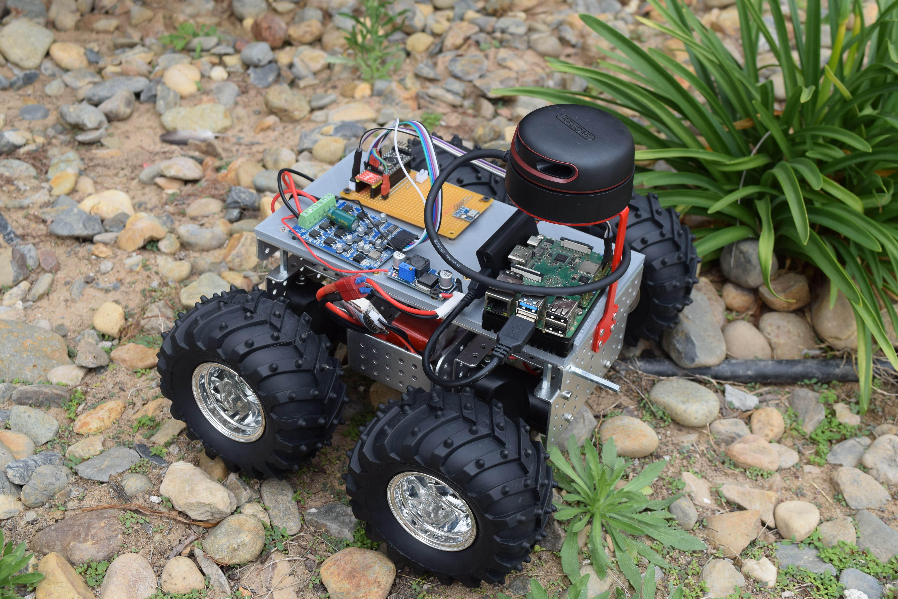

# What is *Rowbot*?

Rowbot is my passion project.
My end goal is to create an autonomous vehicle capable of carrying out specific tasks.
In its current stage, Rowbot is small rover built upon the Wild Thumper development platform.

## Here's what it looks like

---

## Components Used

### Onboard Computer

Today, the main computer aboard Rowbot is the Nvidia Jetson Nano.
This SOC provides two Camera Serial ports, making it easier, and cheaper,
    to develop a vison-based mapping system.

### Sensors

Rowbot uses the following sensors:

- [RPLidar A2 2D Range Scanner](https://www.slamtec.com/en/Lidar/A2)
- [MPU6050 Accelerometer and Gyroscope](https://invensense.tdk.com/products/motion-tracking/6-axis/mpu-6050/)