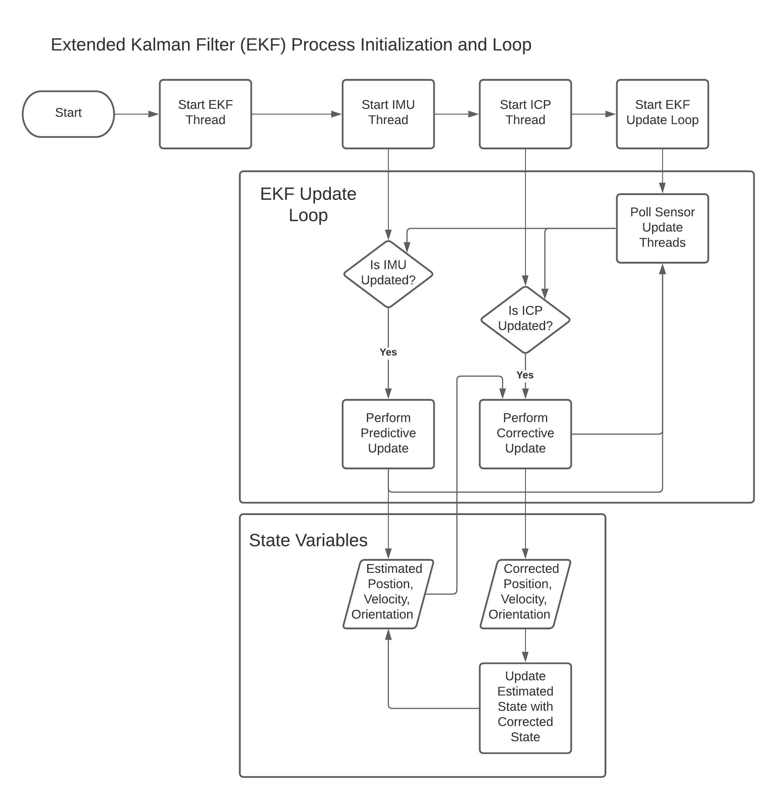

# Software Overview of Rowbot

Rowbot uses an Error-State Extended Kalman Filter (ES-EKF). 
This is a variation of the Extended Kalman Filter (EKF) which estimates 
    state errors as opposed to directly estimating the state.
For an excellent overview of the EKF, see section 3.3 of 
    Probabilistic Robotics (Thrun, Burgard, Fox).

## Here is a high-level overview of the filter employed in Rowbot's localization.

